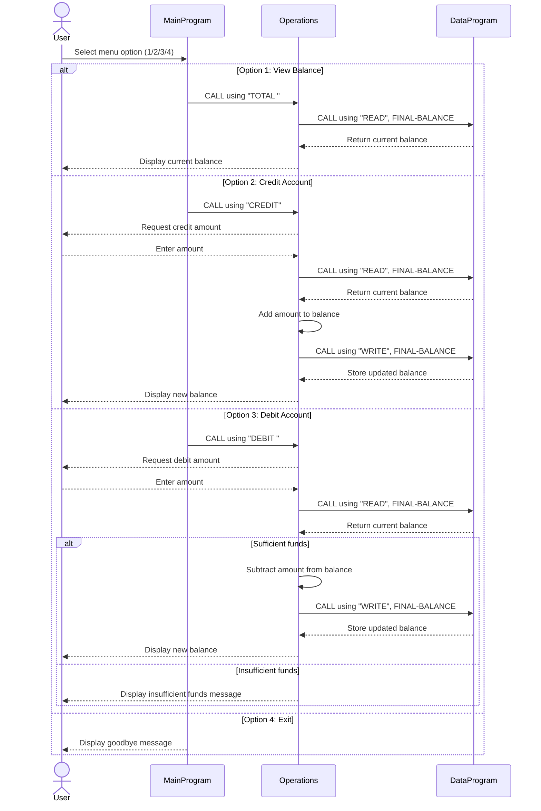

# Student Account COBOL System Documentation

## Overview
This project implements a simple student account management flow in COBOL.
It is structured as three programs with clear responsibilities:
- Main menu and user interaction
- Account operation processing
- Balance data access

## COBOL Files and Purpose

### src/cobol/main.cob
**Program ID:** `MainProgram`

**Purpose:**
- Entry point of the application.
- Presents a looped menu for account actions.
- Routes user choices to the operations layer.

**Key Logic:**
- Repeats while `CONTINUE-FLAG` is `YES`.
- Supports options:
  - `1` View Balance
  - `2` Credit Account
  - `3` Debit Account
  - `4` Exit
- Calls `Operations` with operation tokens:
  - `TOTAL ` (view balance)
  - `CREDIT` (credit account)
  - `DEBIT ` (debit account)

### src/cobol/operations.cob
**Program ID:** `Operations`

**Purpose:**
- Handles account business operations.
- Validates debit feasibility.
- Delegates balance persistence to `DataProgram`.

**Key Logic:**
- Receives operation type from caller through linkage.
- For `TOTAL `:
  - Reads current balance from `DataProgram` using `READ`.
  - Displays current balance.
- For `CREDIT`:
  - Requests amount from user.
  - Reads current balance.
  - Adds amount.
  - Writes updated balance using `WRITE`.
- For `DEBIT `:
  - Requests amount from user.
  - Reads current balance.
  - Debits only if balance is sufficient.
  - Otherwise displays insufficient funds message.

### src/cobol/data.cob
**Program ID:** `DataProgram`

**Purpose:**
- Centralized balance storage and retrieval.
- Provides a simple `READ`/`WRITE` interface.

**Key Logic:**
- Stores balance in working storage variable `STORAGE-BALANCE`.
- On `READ`: returns stored balance to caller.
- On `WRITE`: updates stored balance from caller.

## Student Account Business Rules
1. Initial student account balance is `1000.00`.
2. Credit operation increases the account balance by the entered amount.
3. Debit operation is allowed only when `current balance >= debit amount`.
4. If debit amount exceeds current balance, no update is performed.
5. Balance read and write are done through `DataProgram` only.
6. Operation names are fixed-width (6 chars) and include trailing spaces where required (`TOTAL ` and `DEBIT `).
7. The balance is held in program memory during execution; it is not persisted to external storage.

## Sequence Diagram
